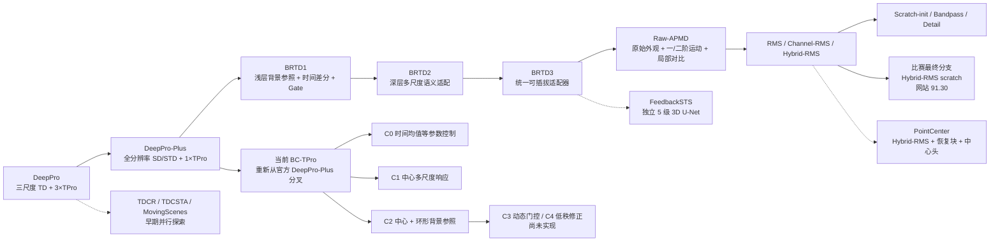
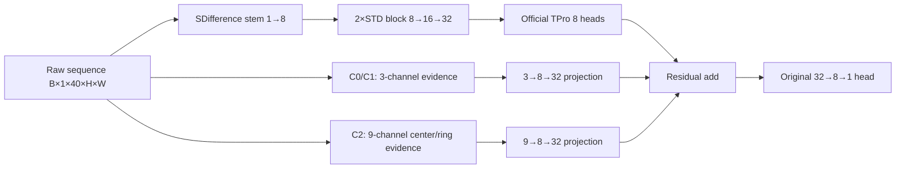

# DeepPro 论文实验改进与优化交接（2026-09-10）

> [!IMPORTANT]
> **2026-09-11 最新状态覆盖：** 当前分支为 `paper-experiments-2026-09-10`。此前
> B1/C0/C1/C2 与无门控 NG1/NG2/NG3 的 seed47 训练跳过了逐 epoch 验证，只评测固定
> `epoch_32_model.pth`。这些指标和由此得到的 C1 结论已被新协议取代，只能作为历史
> provenance，不能再写作当前结果。旧表与产物见
> [`RESULTS.md`](../experiments/bc_tpro_nongate_noise8_seed47_2026-09-10/RESULTS.md) 和
> [Excel](../experiments/bc_tpro_nongate_noise8_seed47_2026-09-10/NG_EXPERIMENT_RESULTS_2026-09-10.xlsx)。
> 当前七结构 seed47 重跑已登记在
> [`bc_tpro_stage1_noise8_bestval_seed47_2026-09-11`](../experiments/bc_tpro_stage1_noise8_bestval_seed47_2026-09-11/README.md)，
> 统一入口为 `tools/run_bc_tpro_bestval.py`。下方正文记录的旧三 seed 预注册现场、旧结果和
> 恢复计划均只用于审计；凡与本覆盖块冲突，均以本覆盖块和验证节奏文档为准。
>
> **2026-09-11 best-validation 协议：** 每个 epoch 后完整验证 internal-val16；以官方
> 逐窗口累计的 micro pixel IoU@0.5 最大化保存 `best_model.pth`，overlap 帧重复计权，
> 精确平局取较晚 epoch。训练仍跑满
> 32 epochs、不早停。训练后由不带 `--epoch` 的独立 `test.py` 加载 best checkpoint，
> 在 internal-val16 计算 Pd@0.5、Fa@0.5 和 AUC27。pixel IoU 只负责同一 run 的 checkpoint
> 选择；七个结构之间仍按 Pd 越高、Fa 越低、AUC 越高的三指标 Pareto 关系综合比较。
> official test20 不参与。final80 因 train80 没有独立 val，无法合法选 best，原固定
> epoch32 活动方案已暂停。完整规则见 [BC-TPro 验证节奏](VALIDATION_SCHEDULE_2026-09-11.md)。

下表为**已被取代的历史 epoch32 结果**，不得作为当前模型结论：

| 模型 | Pd@0.5 (%) ↑ | Fa@0.5 (×10⁻⁵) ↓ | AUC27 ↑ |
|---|---:|---:|---:|
| B1 | 78.921569 | 3.227150 | 0.932218228 |
| C1 | 78.851541 | 2.799961 | 0.971487124 |
| C2 | 78.011204 | 2.959040 | 0.973573062 |
| NG1 | 77.731092 | 3.605185 | 0.942356952 |
| NG2 | 77.871148 | 3.416614 | 0.960096460 |
| NG3 | 75.490196 | 2.680206 | 0.941664698 |

## Material Passport

- Artifact ID：`deeppro-paper-experiment-handoff-2026-09-10`
- Artifact type：实验研发交接与恢复入口
- Origin workflow：academic-research-suite / experiment-agent
- Verification status：`HISTORICAL_SNAPSHOT; SUPERSEDED_BY_LATER_STATUS`
- Version label：`handoff_v2_history_and_completeness_audited`
- Stage at original evidence cut-off：Noise8 upstream-aligned Stage1，B1 已完成，候选尚未完成
- Original evidence cut-off：2026-09-10，Asia/Shanghai
- Source audit：本地代码/日志/指标、官方固定 commit、官方 eval、Crossref/DOI 元数据
- Repository：`/home/user/4T_Storage/SJY/CSIG2026/DeepPro-main`

## 当前接手提示

将下面这段原样发给新对话即可：

> 请先完整阅读
> `/home/user/4T_Storage/SJY/CSIG2026/DeepPro-main/docs/EXPERIMENT_OPTIMIZATION_HANDOFF_2026-09-10.md`，
> 然后读取 `docs/VALIDATION_SCHEDULE_2026-09-11.md` 和
> `experiments/bc_tpro_stage1_noise8_bestval_seed47_2026-09-11/README.md`。先做一次只读状态、
> GPU、磁盘、SwanLab 和 Git 差异检查，再用 `tools/run_bc_tpro_bestval.py` 继续或启动七结构
> seed47 重跑。每 epoch 验证 internal-val16，按官方逐窗口累计的 micro pixel IoU@0.5
> 保存 best，跑满 32
> epochs 后用不带 `--epoch` 的 `test.py` 评测 `best_model.pth`。不要读取 official test20，
> 不要启动 final80，不要使用预训练权重，不要用 F1 选模，不要生成 SHA256/MD5，不要使用
> GPU3，也不要覆盖历史产物。结构之间只按 Pd/Fa/AUC 三指标 Pareto 关系综合判断。

## 1. 当前研究目标

比赛提交阶段已经结束。当前目标是以 DeepPro-Plus 论文为 baseline，在
`NUDT-MIRSDT-Noise8.0_FJY` 上开展可发表的模型改进、消融、统计汇总和论文实验。

当前创新主线是 BC-TPro：保留原 DeepPro-Plus/TPro 主干，通过原始浅层时序证据、
多尺度中心响应和局部环形背景参照，判断时间异常来自弱目标还是动态背景/噪声，目标是在
不明显损失 Pd 的条件下降低 Fa，并提升完整 Pd-Fa 曲线 AUC。

原始思路材料位于：

`/home/user/.codex/attachments/0f2f34ac-e455-4437-96e7-36d6959cd22d/pasted-text.txt`

该材料是设计依据，不是已验证结论。其中任何“加载或保留预训练参数”的建议已经被后续
用户决定覆盖；当前及未来实验必须从随机权重训练。

## 2. 不可违反的当前决策

1. Baseline 必须与 `git@github.com:TinaLRJ/DeepPro.git` 对齐。
2. 官方锚点固定为 commit `8fa1a68b94eb22e94ccd0529e6c5ceccdaa7ec28`。
3. 所有新训练均为 scratch-only：`base_ckpt/spatial_ckpt/st_ckpt` 必须为空，
   `freeze_pretrained=0`，`resume=never`。
4. 当前数据集只使用：
   `/home/user/4T_Storage/SJY/CSIG2026/datasets/NUDT-MIRSDT-Noise8.0_FJY`。
5. 只允许物理 GPU 0、1、2；GPU3 禁止进入训练、评测或后处理。
6. NUDT/Noise8 检测、继续门槛、候选资格、排序、锁定和论文主结果只使用：
   `Pd@0.5`、`Fa@0.5`、官方 27 阈值 Pd-Fa AUC。
7. F1 不得作为 NUDT/Noise8 检测指标、早停依据、checkpoint 选择依据或候选排序依据。
   历史 JSON/日志中的 Pixel F1 仅为兼容字段，active analyzer 会忽略它。
8. 官方逐窗口累计的 micro pixel IoU@0.5 只用于同一 run 内选择 `best_model.pth`；训练 loss 和其余 pixel
   指标只作优化诊断。不同架构仍用 Pd/Fa/AUC 三指标综合比较。
9. raw-logit 与 0.01 dense-grid 若执行，只是敏感性分析，不得参与门控或选模。
10. 不生成、不要求、不校验 SHA256、MD5 等文件内容哈希。
11. 当前确认性重跑关闭 SwanLab，避免代理故障中断；本地训练日志和队列 marker 为权威。
12. 当前 BC-TPro 正式 Stage1 流水线不读取 official test20 图像或生成其预测；test20 不参与逐 epoch
    验证、checkpoint 选择或七结构比较。final80 因没有独立 val 而暂停。历史 29 模型实验
    已评测过同一 test20，论文必须披露该历史暴露。2026-09-11 官方实现审计还用已停止的
    临时 C1 checkpoint 做过一次 test20 只读计数对拍；它未进入任何模型结果或选择。
13. 不需要持续监视训练；只做启动验收和完成、失败或需要人工决策时的节点检查。
14. 仓库是脏工作树，禁止 `git reset --hard`、`git checkout --` 或盲目提交全部改动。
15. 历史比赛 ZIP、提交 TXT 和校验文件的删除是用户明确要求，不要恢复。

## 3. 环境与路径

| 项目 | 当前值 |
|---|---|
| 仓库 | `/home/user/4T_Storage/SJY/CSIG2026/DeepPro-main` |
| Noise8 数据 | `/home/user/4T_Storage/SJY/CSIG2026/datasets/NUDT-MIRSDT-Noise8.0_FJY` |
| Clean 质心回退 | `/home/user/4T_Storage/SJY/CSIG2026/datasets/NUDT-MIRSDT` |
| Python | `/home/user/anaconda3/envs/sjyPID/bin/python`，3.8.5 |
| PyTorch / CUDA / cuDNN | 2.1.2 / 12.1 / 8.9.2 |
| SwanLab | 0.7.15 |
| 数值与图像库 | NumPy 1.24.4；Pillow 10.4.0；SciPy 1.9.3；OpenCV 4.9.0 |
| 评价库 | scikit-image 0.16.2；scikit-learn 1.3.2 |
| NVIDIA driver | 560.35.03 |
| GPU | 4 × RTX 3090 24 GiB；只使用 0/1/2 |
| 训练日志根目录 | `/home/user/4T_Storage/SJY/CSIG2026/DeepPro-main/log/sem_seg` |
| Stage1 实验 | `experiments/bc_tpro_stage1_noise8_upstream_2026-09-09` |
| Final80 实验 | `experiments/bc_tpro_final_noise8_2026-09-09` |

2026-09-10 最后一次主机检查：GPU 0/1/2 各约占 25 MiB、利用率为 0；GPU3 不使用。
存储卷剩余约 117 GiB、使用率 97%，启动较大新矩阵前应再次检查容量。

运行时白名单在 `tools/project_runtime_env.sh`，当前为 `CSIG_ALLOWED_GPU_IDS=0,1,2`。

### 数据副本事实与迁移约束

- 当前副本包含 120 条序列×100 帧，共 12,000 对 8-bit 灰度 PNG 与二值 mask。
- `train.txt/test.txt` 中保留官方 `SequenceX/Mix/*.mat` 形式；当前 loader 只提取第一段
  `SequenceX`，再读取 `images/*.png` 和 `masks/*.png`。不要把清单机械改写为 PNG 路径。
- 数据名称、噪声模型和本地统计与论文 HiNo 高度对应，但尚无证据证明当前图像与官方
  发布压缩包逐文件相同。用户已禁止新哈希流程，因此只做路径、数量、尺寸、清单和标签
  语义检查，不生成内容哈希认证。
- Noise8 目录没有 `masks_centroid`，Pd/Fa 评测依赖相邻 Clean
  `NUDT-MIRSDT/SequenceX/masks_centroid`；迁移数据时两者必须一起保留。
- 历史文档中的 `datasets_v1/...` 是旧路径，当前不存在，不得原样执行。

## 4. Git 状态

- 当前分支：`nudt-mirsdt-all-models-2026-09-01`
- 当前本地 HEAD：`2914290fe8ee837855bc31d3e26dfac829954226`
- 用户仓库 remote：`origin` 和 `CSIG2026`
- 官方论文 remote：`deeppro-paper -> git@github.com:TinaLRJ/DeepPro.git`
- 官方 `main` 在 2026-09-10 再次核对仍为 `8fa1a68...`。
- 当前没有持久化的 `deeppro-paper/main` 本地 tracking ref；此前官方源码审计使用的
  `/tmp/deeppro_official_align.TBNotk/DeepPro` 是临时目录。再次审计时应只读 fetch/clone
  固定 commit，不依赖该 `/tmp` 路径，也绝不能向官方 remote 推送。
- GitHub 仓库元数据和根目录当前未提供明确 LICENSE；不要自行推断授权范围。论文实验
  可引用官方实现，但对外重新分发代码前仍需单独确认许可。
- 当前对齐、BC-TPro、指标协议和实验文件尚未形成新的确认提交；不得声称已经上传。
- 工作树中还包含历史文档整理、比赛产物删除和其他用户改动。提交时必须按主题审阅并
  选择性暂存，不能使用 `git add -A` 后直接提交。

## 5. 官方 DeepPro 对齐边界

### 已对齐

- B1 `DeepPro-Plus_BCTPro(structure_variant=none)` 与官方 DeepPro-Plus 都有 70,913
  个参数和 100 个 state 项。
- CPU 对照覆盖初始化、训练前向、Soft-IoU 和一次 Adam 更新，结果逐位一致。
- NUDT mask 使用 Pillow 默认 resize，再把所有正像素二值化。
- 每个 100 帧序列生成 96 个候选训练窗口，最后一帧不进入候选窗。
- 256→128 crop 起点上界与官方一致，为 127。
- NUDT/Noise8 固定归一化均值/标准差为 `105.4025/26.6452`。
- official train80 共有 `80×96=7680` 个候选 clip；`sample_rate=0.1` 时每 epoch 的
  Dataset 长度为 768。clip 按自身有效长度加权采样；中间帧有目标时以 0.75 概率尝试
  目标中心裁剪，早期短 clip 根据样本索引奇偶在前端或后端补零。
- 当前 Stage1 train64 相应为 6144 个候选 clip、Dataset 长度 614，global batch 4 且
  `drop_last=True` 时每 epoch 153 个训练 step；final80 才使用上述 768 样本/epoch。
- 测试每条 100 帧序列使用 `[0,40)`、`[36,76)`、`[60,100)` 三个窗口，重叠位置
  对 sigmoid 概率逐像素取最大值。
- T=40、global batch=4、epoch=32、Adam、lr=0.001、weight decay=1e-4、每 10 epoch
  乘 0.7、Soft-IoU、FP32。
- 本地 Noise8 的 `train.txt/test.txt` 与官方仓库清单逐字节一致：8000/2000 帧。

### 有意不复制的官方行为

- 官方训练代码会在训练过程中反复使用 test20 评测并选择 best checkpoint，存在测试集
  参与选模的问题。本项目使用 train80 派生的固定 train64/internal-val16 做 Stage1；每个
  epoch 只在 internal-val16 验证，并按官方逐窗口累计的 micro pixel IoU@0.5 选择该 run
  的 best checkpoint，
  official test20 不参与。
- 本项目显式固定 seeds 47/49/51 并启用确定性训练；不复制官方的时间相关 worker seed。
- 官方 `train.py` 虽定义 `seed_everything()` 却没有调用；`gpu_num>1` 分支硬编码
  `0,1,2,3`，且非空目录中的 `best_model.pth` 会被自动恢复。本项目使用三个独立单卡
  scratch run、唯一空目录和 `resume=never`，不能直接复制官方多卡分支。
- 官方 ragged `np.random.choice(samplelist)` 在 NumPy 1.24 可失败；本地改为对索引做
  相同概率抽样，是兼容性修复，不改变候选 clip 分布。
- 推理使用 `eval_chunk_rows=32` 控制显存；与整图计算数值等价，但不宣称逐位一致。
- 本地 ShootingRules 对图像边界做安全裁剪。当前 official test20 的 1729 个正帧中，
  centroid 最小边界距离为 30 像素，所以在本数据上与官方负切片写法不会产生边界差异。

因此应写作“官方架构与训练数据语义对齐的可复现实验”，不要写成逐随机轨迹或逐 bug
复刻。

## 6. 唯一有效的检测指标合同

官方 NUDT/Noise8 的主指标为：

\[
Pd(\tau)=\frac{\sum_s TrueNum_s(\tau)}{\sum_s TgtNum_s(\tau)}
\]

\[
Fa(\tau)=\frac{\sum_s FalseNum_s(\tau)}{\sum_s Pixels_s}
\]

\[
AUC=\operatorname{auc}(Fa(\tau),Pd(\tau))
\]

- 论文实验设置和官方完整 `eval.txt` 表明表中 Pd/Fa 使用 sigmoid 阈值 `0.5`；官方
  README 本身只列结果表，没有单独写明该阈值。
- Fa 分母是全部图像像素数，不是负类像素数。
- 每个 centroid 八连通区域为一个目标；目标像素附近 3×3 有预测即命中，目标附近 9×9
  区域不计入虚警像素。
- low-SNR 分组依赖 official `test.txt` 的固定顺序：索引 `[7,13,14,15,16,17,18,19]`
  对应 `Sequence92/47/56/59/76/101/105/119`；其余 12 条为 high-SNR。不得重排后继续
  使用旧数字索引。
- AUC 使用以下 27 个阈值：

`0, 1e-20, 1e-10, 1e-8, 1e-7, 1e-6, 1e-5, 1e-4, 1e-3, 1e-2, 0.1,
0.2, 0.3, 0.35, 0.4, 0.45, 0.5, 0.55, 0.6, 0.65, 0.7, 0.8, 0.85, 0.9,
0.95, 0.99, 1`。

官方论文 HiNo/官方仓库 Noise 权重的 DeepPro-Plus 参考结果为：Pd 76.23%、Fa
1.69×10^-5、AUC 0.9171；原始官方日志精度为 1318/1729=0.76229、2234 个虚警像素
对应 1.688470×10^-5、AUC 0.91705。当前目录名去掉了官方权重目录中的
`(g0.15-o1.3)` 后缀；现有证据只证明 train/test 清单相同，没有证明两份噪声图像逐文件
同一，因此正式判断优先使用配对本地 B1，不能仅凭名称声称完全复现官方 HiNo 数据。

Stage1 的 internal-val16 与 official test20 不同，不能把两者直接写成公平性能提升。
理论上只有合规的 final/test20 结果才能按相同测试划分与官方表格并列，但当前 final80
没有独立 val，无法按 best-checkpoint 规则执行，已经暂停；test20 也曾被历史模型探索
使用，不能包装为完全独立的未见测试。

指标修订的权威文件为：

`experiments/bc_tpro_stage1_noise8_upstream_2026-09-09/OFFICIAL_METRIC_AMENDMENT_2026-09-10.md`

修订发生在 B1 三个种子完成后、任何 C0/C1/C2 完成训练或产生指标之前，因此没有根据
候选结果事后改规则。

## 7. 当前模型矩阵

| 代码 | structure_variant | 参数量 | 目的 |
|---|---|---:|---|
| B1 | `none` | 70,913 | 官方 DeepPro-Plus baseline |
| C0 | `temporal_control` | 71,233 | 等参数量时间均值控制，排除单纯增参解释 |
| C1 | `center_multiscale` | 71,233 | 5/9/17 帧零直流、单位范数中心时间响应 |
| C2 | `center_ring` | 71,281 | 中心、环形背景及二者差的固定融合 |

模型文件：`networks/models/DeepPro-Plus_BCTPro.py`。

适配器文件：`networks/layers/bc_tpro_adapter.py`。

C0/C1 都使用 3 通道证据经 `3→8→32` 残差投影；C2 使用 9 通道证据经
`9→8→32` 投影。新增输出投影为零初始化，所以所有候选初始 logits 与 B1 对齐。

C3 动态门控和 C4 低秩动态时间修正尚未实现。只有 C2 通过修订后的官方指标继续门槛
时，才能先登记 C3 协议再实现；不得提前增加模块。

## 8. 2026-09-10 指标代码修订

已经完成并通过测试：

- `test.py`：即使额外计算 dense grid，日志和 JSON 的主 AUC 也只来自官方 27 点；
  `auc_dense_grid` 仅为补充字段。
- `train.py`：默认 early stopping metric 从 `eval_f1` 改为 `eval_iou`；upstream 训练的
  SwanLab 不再记录 Precision/Recall/F1，只保留 loss、IoU、lr 和损失分量。控制台历史
  字段保留但明确标为训练诊断，以兼容已完成 B1 日志。
- `tools/analyze_bc_tpro_noise8_stage1.py`：正式表格、bootstrap 和继续门槛使用
  Pd@0.5、Fa@0.5、AUC27。
- `tools/analyze_bc_tpro_noise8_paper.py`：候选资格只用官方三指标；后续用户指令已废止
  AUC 优先排序，改为三指标 Pareto 判定，存在未决权衡时 fail-closed。
- `tools/analyze_bc_tpro_noise8_final.py`：最终 overall、low-SNR、high-SNR 表只输出
  Pd/Fa/AUC。
- `tools/validate_bc_tpro_noise8_final.py` 与 `tools/run_bc_tpro_noise8_final.sh`：已固定为
  upstream Stage1、schema2、FP32、`upstream_compat=1` 和官方三指标。

候选资格规则：

1. 三 seed 平均 AUC27 不低于配对 B1；
2. 三 seed 平均 Pd@0.5 相对 B1 下降不超过 1 个百分点；
3. 三 seed 平均 Fa@0.5 相对 B1 有正向下降；
4. 至少 2/3 seed 同时满足 Pd 不下降、Fa 不增加；
5. 每个 seed 的评测时间不超过同 seed B1 的 1.3 倍；
6. profile、split、checkpoint、FP32、scratch 和运行身份全部通过。

这是本研究在候选结果产生前登记的选择规则，不应声称它来自官方仓库；官方仓库只定义
指标，没有定义如何把三项指标合并成唯一候选。

C3 继续门槛比普通候选资格更严格，C2 必须同时满足：三 seed 平均 Fa@0.5 相对 B1
下降至少 20%；平均 Pd@0.5 下降不超过 1 个百分点；平均 AUC27 不下降；任一 seed 的
Fa 恶化不超过 20%、Pd 下降不超过 3 个百分点、latency 不超过同 seed B1 的 1.3 倍；
并且 C2 相对 C1 在每个 seed 的 Pd/Fa/AUC 三项均非劣，至少一项严格改善。2026-09-10
amendment 已废止旧计划中“raw-logit 一致才允许 C3”的强制条件。

## 9. 原证据截点实验状态（已过时）

Stage1 manifest：B1/C0/C1/C2 × seeds 47/49/51，共 12 个运行。

当前一次性状态检查结果：

- Screen：无会话。
- 相关 train/test/evaluate 进程：无。
- B1：3/3 `.done`，3/3 epoch-32 checkpoint，3/3 internal-val JSON。
- C0：3/3 `.failed`，均未进入训练迭代，没有 checkpoint。
- C1/C2：共 6 个任务未启动。
- exact-logit：0；现在是可选诊断，不影响锁定。
- candidate lock：未生成。
- 当前 BC-TPro final80/official test：未运行。

B1 三个 run 都保存了完整 `source_snapshot/`，跨 seed 内容相同。与当前工作树直接
`cmp` 后，只有 `train.py/test.py` 因 2026-09-10 指标与 SwanLab 策略修订而不同；模型、
adapter、loader、Soft-IoU、ShootingRules、TPro 和 `write_results.py` 均相同。C0 在
`swanlab.init` 阶段失败，早于源码快照步骤，因此没有 C0 snapshot 是预期现象。

B1 internal-val16 的官方指标：

| Seed | Pd@0.5 (%) ↑ | Fa@0.5 (×1e-5) ↓ | AUC27 ↑ |
|---:|---:|---:|---:|
| 47 | 78.9216 | 3.2271 | 0.932218 |
| 49 | 82.0028 | 5.1263 | 0.945569 |
| 51 | 81.5826 | 3.1610 | 0.942659 |
| Mean ± sample SD | 80.8357 ± 1.6709 | 3.8381 ± 1.1160 | 0.940149 ± 0.007020 |

B1 每个 seed 从训练到外部评测约 2051/2085/2066 秒，即约 34–35 分钟。

B1 三个 SwanLab run 已创建，但训练期间上传和结束标记都出现过代理断连，因此云端曲线
可能不完整；本地训练日志、checkpoint 和指标 JSON 才是权威证据。对应 run id 为
seed47 `o48vv0hci8gq8yhseet8j`、seed49 `0it5ifcfwdxhep3i9f90r`、seed51
`tt5svmfb7n39gct7mg30i`。

## 10. C0 失败原因与安全恢复

C0 三个任务在 2026-09-09 18:54 启动约 18 秒后失败。共同原因是 SwanLab 请求
`api.swanlab.cn` 时，SOCKS5 代理 `127.0.0.1:1080` 当时返回 connection refused。
这不是 CUDA、显存、模型、数据或 loss 错误。

2026-09-10 最近一次检查中，1080 端口已监听，SwanLab API 路由探测成功。但 `curl`
成功不证明 API key 登录和 run 初始化必然成功；恢复后的启动验收必须确认三个进程已经
越过 `swanlab.init` 并进入第一个 epoch。

当前失败目录仅包含约 2.7 KiB 参数日志和空 SwanLab 占位，没有权重。启动器会正确拒绝
覆盖 `.failed` 状态和非空实验目录，因此恢复前要把三组失败证据移动到归档，而不是删除：

1. 确认没有同名 screen、训练和评测进程。
2. 为本次恢复创建唯一归档目录，例如
   `log/sem_seg/_archive/2026-09-10/swanlab_proxy_failed_c0/`。
3. 逐个移动三份 `status/c0_*.failed`、三份 `launcher_logs/c0_*.log` 和三座 C0 实验目录
   到该归档，保留原相对名称。
4. 不移动或修改任何 `b1_none_seed*.done`、B1 日志、checkpoint 或 JSON。
5. 再做 `DRY_RUN=1`，确认 B1 会跳过且 C0/C1/C2 命令保持一致。

不要直接删除失败证据，也不要用宽泛通配符移动整个 `2026-09-09` 或 `_queues` 目录。

## 11. 原恢复计划（已过时，不执行）

### A. 一次性只读预检查

```bash
cd /home/user/4T_Storage/SJY/CSIG2026/DeepPro-main
nvidia-smi
screen -ls
df -h /home/user/4T_Storage/SJY/CSIG2026/DeepPro-main
ss -lnt '( sport = :1080 )'
curl -sS -o /dev/null -I --connect-timeout 5 --max-time 8 https://api.swanlab.cn
git status --short
```

### B. 回归检查

```bash
PYTHONDONTWRITEBYTECODE=1 /home/user/anaconda3/envs/sjyPID/bin/python \
  -m unittest discover -s tests
git diff --check
bash -n tools/run_bc_tpro_stage1_noise8.sh \
  tools/run_bc_tpro_stage1_noise8_upstream.sh \
  tools/run_bc_tpro_noise8_final.sh
```

2026-09-10 当前结果为全仓 CPU tests `107/107` 通过；`py_compile`、`bash -n` 和
`git diff --check` 通过。

### C. 安全归档 C0 失败占位

先按第 10 节解析 manifest 并确认九个精确目标，再逐个移动。不得自动重试崩溃实验；
新对话应先向用户简要报告将复用 B1、只恢复 C0/C1/C2，然后再启动。

### D. 干跑

```bash
DRY_RUN=1 bash tools/run_bc_tpro_stage1_noise8_upstream.sh
```

必须确认：

- 12 条训练计划和 12 条评测计划身份完整；实际恢复时 B1 会因 `.done` 被跳过；
- GPU 只出现 0/1/2；
- `train_amp=0`、`eval_amp=0`，评测无 `--amp`；
- `upstream_compat=1`；
- `early_stopping_metric=eval_iou`，且 patience=0；
- 三个 checkpoint 输入路径为空，`resume=never`；
- SwanLab project/group 正确；
- official test 不进入 Stage1 命令。

### E. 后台恢复 Stage1

使用新的 screen 名称和新的 screen log。建议后台顺序只包括：

1. `bash tools/run_bc_tpro_stage1_noise8_upstream.sh`
2. `python tools/analyze_bc_tpro_noise8_stage1.py --profile upstream8fa1a68_fp32 ...`
3. `python tools/analyze_bc_tpro_noise8_paper.py --profile upstream8fa1a68_fp32 ...`

不要把 raw-logit 脚本作为候选锁定的强制步骤。启动后只检查一次 screen 存活、三张卡上
各有一个预期进程、SwanLab 初始化成功；之后不持续轮询。

### F. Stage1 完成后的分支

- 若 analyzer 生成 `LOCKED_CANDIDATE.json`：先验证 schema2 与官方指标合同，然后 dry-run
  `tools/run_bc_tpro_noise8_final.sh`。
- 若返回 `C3_REQUIRED`：停止，不运行 final80。先登记 C3 精确结构、参数量、同一训练协议
  和官方三指标规则，再实现、测试、训练 C3。
- 若任何 run 失败：保留现场，不自动重试；区分网络、数据、代码、CUDA 和磁盘原因。

### G. 历史 Final80/official test 计划（已废止，不执行）

原工具入口为 `tools/run_bc_tpro_noise8_final.sh`。该方案按固定 epoch32 测试，且 train80
没有独立 val，不能满足当前 best-checkpoint 协议，现已暂停；以下仅保留历史设计：

它必须满足：

- 只接受 upstream Stage1 schema2 candidate lock；
- B1 与唯一候选在 official train80 上各跑三 seed；
- 全部 final80 checkpoint 完成并验证后，才允许当前 BC-TPro 流程再次评测 test20；
- test 使用 FP32、27 个官方阈值、每 checkpoint 一次；
- 结果只汇总 overall/low-SNR/high-SNR 的 Pd@0.5、Fa@0.5、AUC27。

## 12. 关键文件导航

| 文件 | 职责 |
|---|---|
| `docs/MODEL_EVOLUTION_ARCHITECTURE_AND_LOSS_2026-08-26.md` | 截至 08-27 的历史模型/损失素材；“当前”表述已过时 |
| `experiments/PAPER_COMPARISON_2026-09-08.md` | 旧 29×2 模型的 Pd/Fa/AUC 探索证据与可比性边界 |
| `paper/DEEPPRO_PLUS_METRIC_ALIGNMENT.md` | 论文书目信息、指标、参数/效率口径与当前可比性 |
| `docs/DEEPPRO_OFFICIAL_ALIGNMENT_2026-09-09.md` | 官方仓库、模型和 loader 对齐边界 |
| `experiments/bc_tpro_stage1_noise8_bestval_seed47_2026-09-11/README.md` | 当前七结构逐 epoch 验证和 best-checkpoint 重跑协议 |
| `tools/run_bc_tpro_bestval.py` | 当前七结构三卡排队重跑入口 |
| `tools/analyze_bc_tpro_bestval.py` | 完成后核验 best checkpoint 并生成 Pareto/Excel 结果 |
| `experiments/bc_tpro_stage1_noise8_upstream_2026-09-09/README.md` | 已被取代的固定 epoch32 Stage1 历史证据 |
| `experiments/bc_tpro_stage1_noise8_bestval_seed47_2026-09-11/PROTOCOL.json` | 当前 best-validation 机器可读协议 |
| `experiments/bc_tpro_stage1_noise8_bestval_seed47_2026-09-11/manifest.tsv` | 当前七个 seed47 run 身份 |
| `experiments/bc_tpro_stage1_noise8_upstream_2026-09-09/UPSTREAM_PROTOCOL.json` | 历史 upstream profile 配置 |
| `experiments/bc_tpro_stage1_noise8_upstream_2026-09-09/OFFICIAL_METRIC_AMENDMENT_2026-09-10.md` | Pd/Fa/AUC 指标合同仍有效；旧 checkpoint 选择已被取代 |
| `experiments/bc_tpro_stage1_noise8_upstream_2026-09-09/manifest.tsv` | 历史 12-run Stage1 身份 |
| `experiments/bc_tpro_stage1_noise8_upstream_2026-09-09/splits/` | 当前复用的固定 train64/internal-val16 |
| `networks/models/DeepPro-Plus_BCTPro.py` | B1/C0/C1/C2/NG1/NG2/NG3 检测网络 |
| `networks/layers/bc_tpro_adapter.py` | BC-TPro 证据和残差适配器 |
| `data_utils/TrainDataLoader.py` | upstream-compatible mask/window/crop |
| `test.py`、`ShootingRules.py`、`write_results.py` | 论文 Pd/Fa/AUC 推理与计数 |
| `tools/run_bc_tpro_stage1_noise8_upstream.sh` | 历史 Stage1 固定 epoch32 复现入口 |
| `tools/analyze_bc_tpro_noise8_stage1.py` | 历史 Stage1 指标聚合、bootstrap、C3 门槛 |
| `tools/analyze_bc_tpro_noise8_paper.py` | 历史 schema2 candidate-lock 工具；不用于当前重跑 |
| `experiments/bc_tpro_final_noise8_2026-09-09/README.md` | 已暂停的 final80/test20 历史方案 |
| `tools/run_bc_tpro_noise8_final.sh` | 已暂停的固定 epoch32 final80 历史入口，不执行 |
| `tools/validate_bc_tpro_noise8_final.py` | final lock、split、checkpoint 和 test 屏障 |
| `tools/analyze_bc_tpro_noise8_final.py` | 最终三指标表和配对差 |
| `log/sem_seg/_queues/bc_tpro_stage1_noise8_bestval_seed47_2026-09-11/` | 当前重跑队列状态和日志 |

旧的 `tools/run_bc_tpro_stage1.sh`、`create_nudt_sequence_split.py`、
`snapshot_bc_tpro_stage1.py`、`evaluate_bc_tpro_exact_logit.py` 以及历史比赛提交 launcher
可能包含哈希、预训练路径、旧 GPU 或旧指标逻辑。它们是只读历史入口；当前新对话只使用
`tools/run_bc_tpro_bestval.py`，不得启动 schema2 final80 工具。

## 13. 证据层级

后续报告必须明确区分：

1. 单元测试/shape/梯度检查：证明代码可执行或数学性质，不证明检测提升。
2. 训练 loss 与 pixel 指标：IoU@0.5 仅用于同一 run 选择 best，其余用于优化诊断；均不
   替代架构间 Pd/Fa/AUC 比较。
3. best checkpoint 的 internal-val16 Pd/Fa/AUC：当前候选筛选证据，不能与 official
   test20 直接比较。
4. final80/test20：当前没有满足 best-checkpoint 规则的活动协议；旧固定 epoch32 方案已
   暂停，且 test20 曾在历史 29 模型探索中暴露。
5. 官方论文/仓库 eval 数值：外部参考，来自官方权重与未完整公开的官方训练环境。

不得把单 seed、训练指标、参数量、代理指标或可视化观感描述为正式性能提升。

## 14. 已知风险与开放问题

- 磁盘使用率较高；训练前检查剩余空间，保留 checkpoint/日志/指标，优先清理可恢复缓存，
  不触碰活动实验和用户文件。
- Noise8 本身没有 `masks_centroid`；测试 loader 回退到 Clean 同名质心。该事实必须写入论文。
- internal-val16 数量较小，三 seed 只能提供初步稳定性证据；bootstrap 仅反映视频重采样，
  不能覆盖所有训练随机性。
- official test20 已用于历史 29 模型探索。当前 selector 的 `official_test_accessed=false`
  仅表示 BC-TPro Stage1 没有读取它，不表示整个项目从未接触；论文应如实披露。
- B1 snapshot 的核心训练语义已核对，但当前 `test.py` 从 run 顶层加载模型/adapter 后，
  模型内部的 `basic.py/TPro.py` 仍可能从仓库根目录导入。final 前应补充以
  `source_snapshot` 为执行根/PYTHONPATH 的入口，或验证完整快照执行闭包。
- 当前七结构重跑期间不要再修改核心模型、adapter、loader、loss、训练或评测语义；如需
  核对历史快照与当前代码，用 `cmp` 直接比较，不生成哈希。
- 当前运行环境不是由官方 requirements 完整锁定；Pillow 默认 resize 语义尤其依赖版本。
  2026-08-24 环境导出只能作为历史记录，每次迁移仍需现场核对。
- 若目标是发表普适性论文，仅 Noise8 单数据集不够。当前候选锁完成后，应另行预登记
  Clean NUDT、其他噪声强度或外部数据集验证，不能在当前选择过程中临时加入。
- 本地效率尚未按论文 256×256/V100 口径测量；现有 elapsed time 不可直接换算论文 FPS。
- 官方仓库没有给出将 Pd/Fa/AUC 合成为唯一模型分数的规则；当前资格和排序是本研究预登记
  规则，不是官方规则。
- 当前工作树尚未整理提交。实验完成前不要混入无关重构；实验完成后按主题拆分提交并验证
  本地/远端 commit 一致，再报告“已上传”。

## 15. 明确禁止的错误恢复方式

- 不要使用旧 launcher 单独重放固定 epoch32 结果；七结构统一重跑只通过
  `tools/run_bc_tpro_bestval.py`。
- 不要从官方发布 checkpoint 或历史比赛 checkpoint 初始化。
- 不要恢复 F1 选模、`eval_f1` 早停或 Proxy F1 阈值扫描。
- 不要把 dense-grid AUC 或 raw-logit fixed workpoint写成主结果。
- 不要为了加速缩短 40 帧、改变 global batch、使用 AMP 或混入 GPU3。
- 不要读取或扫描 official test20 的预测性能，也不要启动已暂停的 final80。
- 不要自动删除 `.failed`、旧日志或源代码快照。
- 不要把旧 modernized AMP 实验与 upstream FP32 实验合并统计。
- 不要向 `deeppro-paper` 官方 remote 推送。

## 16. 接手后的第一项实际工作

新对话的第一项工作应是：一次性验证 GPU、磁盘、SwanLab、Git 和当前 best-validation
队列，然后核对 `tools/run_bc_tpro_bestval.py` 的七个 seed47 scratch 命令。继续或启动时
保持每 epoch internal-val16、32 轮不早停和 best checkpoint 评测；不要打开 official
test20，也不要启动 final80。

## 17. 网络历次更新过程

详细历史文档为
[`MODEL_EVOLUTION_ARCHITECTURE_AND_LOSS_2026-08-26.md`](MODEL_EVOLUTION_ARCHITECTURE_AND_LOSS_2026-08-26.md)，
但它是 2026-08-26 的比赛研发快照，其中“当前主线”“当前损失”和运行命令已经过时。
本节是面向当前论文任务的更新版摘要。



这不是一条“每代都更好”的单线升级史。TDCR/TDCSTA/MovingScenes、FeedbackSTS 和
PointCenter 是并行探索；当前 BC-TPro 也不是继续堆叠 Raw-APMD，而是为了可归因性重新
从官方 DeepPro-Plus 分叉。

| 日期 | Git/实验节点 | 主要更新 | 当前状态 |
|---|---|---|---|
| 2026-06-28 | `96b2ea0` | 初始化 DeepPro / DeepPro-Plus | 官方基础 |
| 2026-07-01~06 | `829e1b8`、`54b0a04`、`b6c9a83`、`74f1c0a` | TDCR、TDCSTA 与三阶段训练 | 并行历史分支；预训练流程停用 |
| 2026-07-15~21 | `ddcb133`、`d2cc7b3` | BRTD1 背景参照适配器 | 历史消融 |
| 2026-07-22~08-07 | `affc323`、`9efed80` | 统一损失库、BRTD2、历史 OHEM | 代码保留，非当前协议 |
| 2026-08-11 | `5052f64` | BRTD3 统一候选框架 | 历史实验容器 |
| 2026-08-17 | `c1d8ba3` | Raw-APMD | 历史结构母体 |
| 2026-08-20~25 | `268838b`、`e5bdbdf` | RMS/Channel/Hybrid、scratch 三卡与新初始化候选 | 比赛阶段 |
| 2026-08-26~27 | `f8fe6d6`、`e3a0a9e`、`fbe1c1d`、`cdeeaf7`、`8260ac9` | 训练可靠性、低显存推理、FeedbackSTS | 历史分支 |
| 2026-08-28~31 | `3c485d5` 打包 | PointCenter 探索与最终 91.30 复现材料 | 比赛历史；最终胜出者仍是 Hybrid-RMS |
| 2026-09-01~08 | 两套 29 模型实验 | Clean/Noise8 单 seed 筛选并补算论文指标 | 探索证据 |
| 2026-09-08~10 | 当前未提交工作树 | 官方对齐 BC-TPro、三 seed、指标 schema2 | 唯一当前主线 |

### 17.1 DeepPro → DeepPro-Plus

| 版本 | 结构变化 | 动机与证据 | 当前定位 |
|---|---|---|---|
| DeepPro | 普通时间卷积 stem；三个空间尺度；每尺度独立 TD 主干与 TPro；上采样拼接 | 多尺度上下文充分，但下采样可能抹除极小目标，三个 TPro 增加计算 | 官方历史基础 |
| DeepPro-Plus | 删除多尺度池化、重复 TPro 与上采样；改为全分辨率 `SDifferenceConv 1→8 → STD 8→16→32 → TPro → 32→8→1` | 保留空间分辨率并提高效率；70,913 个参数 | 当前 baseline 来源 |

官方 TPro 应准确描述为：把 32 通道分为 8 组，每组对每个空间位置的时间向量使用独立
`Linear(T→out_len)` 变换，并带 `1/sqrt(T)` 缩放，再经 BN、ReLU 和 `1×1×1` 卷积。
它不是 QKV self-attention，即使代码局部变量使用了 `qkv` 名称。

论文消融还有两个重要约束：DeepPro-Plus 的一个全分辨率空间—时间层级显著提高
threshold-0.5 Pd，但相对 temporal-only DeepPro 的 AUC 可能下降；STD-ResBlock 从 2 个
继续加到 3/4 个时，Noise 指标和计算成本都变差。因此“只增加深度”或“只再加空间分支”
不足以作为当前创新。

### 17.2 TDCR / TDCSTA / MovingScenes 并行探索

- TDCR 用显式时间差分卷积替换部分原始时间建模。
- TDCSTA 组合 TDC、普通 3D 时空支路、当前帧 2D 支路以及 self/cross attention；历史
  三阶段训练依赖支路预训练，已被 scratch-only 决策停用。
- `DeepPro-Plus_forMovingScenes` 是另一个并行分支；官方文件当前存在错误的
  `super(generator, self)`，不能未经修复和专项测试直接当作 baseline。

这些分支没有形成当前 BC-TPro 的直接祖先关系。

### 17.3 BRTD1 → BRTD2 → BRTD3

| 版本 | 新增/移动模块 | 主要问题与后续影响 |
|---|---|---|
| BRTD1 | 在 8 通道 stem 后加入 3×3/7×7 背景参照、时间差分、尺度路由、Sigmoid gate、零初始化残差 | 位置太浅、差分和门控偏强；历史单模型 Recall 下降，但与其他模型融合有互补性 |
| BRTD2 | 移到 32 通道深层；加入 appearance、dilation 1/2/4 的 3/5/9 帧分支、局部对比和 GroupNorm | 保留绝对信息，但 no-gate 消融优于 gate；形成“门控可能压掉弱目标”的经验 |
| BRTD3 | 把 shallow/deep/raw/post-TPro 多种插入位置和 second-order、LFP、对齐、双向、TDC 双流、多尺度头统一为 `structure_variant` | 主要价值是可控单变量实验容器；不是一个已证明最优的单模型 |

### 17.4 Raw-APMD 与 RMS 系列

Raw-APMD 绕过差分 stem，从原始序列显式提取：逐帧绝对外观、offset 1/2/4 的一阶与
二阶差分、局部中心—周围对比，并以无 Sigmoid gate 的有符号残差注入主干。它用于解决
早期 BRTD 可能过度抑制弱目标的问题。

归一化随后经历：

1. GroupNorm：会减去均值，可能破坏绝对亮度；
2. 共享 RMS：保留均值，但强通道可能统一缩放弱通道；
3. Channel-RMS：减小跨通道干扰，但历史双 seed 波动较大；
4. Hybrid-RMS：学习共享与逐通道二阶矩之间的收缩比例。

Motion detrend、multiscale contrast 及其组合在 SatVideo scratch 网站实验中低于纯
Hybrid-RMS，因此退出当时的默认分支，但代码仍为历史复现保留。这个结论仅属于对应
SatVideo 协议，不能外推为它们在 NUDT/Noise8 上永远无效。

### 17.5 Scratch-init / Bandpass / Detail 与比赛最终分支

- Scratch-init 把历史全零 projection 改为 `0.05×Kaiming`，让适配器上游从第一次反向
  即获得梯度；网站 86.45，未超过当时 Hybrid-RMS scratch 的 86.71。
- Bandpass 再加入有效帧 3 帧均值减 9 帧均值；网站 86.47，仍未超过 86.71。
- Detail 加入 32→8 主干细节旁路；当时未进入优先比赛队列，后在 NUDT 29 模型筛选运行。
- 比赛最终 91.30 使用的是纯 `raw_apmd_hybrid_rms` scratch、seed47、epoch86 和自适应
  后处理，不是 Scratch-init、FeedbackSTS 或 PointCenter。91.30 是比赛综合分，不是
  当前论文 Pd/Fa/AUC。

### 17.6 FeedbackSTS 与 PointCenter 分支

- FeedbackSTS 放弃 DeepPro-Plus/TPro 主干，改用通道 8/16/32/64/128 的五级 3D U-Net、
  前向/反向稀疏语义传播和金字塔形变对齐。后续单 seed NUDT 实验接近失效，说明该实现
  没有成功；不能外推为所有对齐传播方法都无效。
- PointCenter 回到 Hybrid-RMS+TPro，增加 NAF-style 局部时序恢复、CBAM-style 调制、
  过滤前头、mask 头和 center 头，最终 `logit=mask+0.25×center`。它有本地实验记录，
  但没有找到独立网站分数证据；91.30 不属于 PointCenter。

### 17.7 当前 BC-TPro

BC-TPro 回到官方 DeepPro-Plus，静态残差加在 post-TPro、原输出头之前：



- C0：5/9/17 帧时间均值等参数控制；
- C1：5/9/17 帧零直流、单位 L2 范数中心响应；
- C2：中心响应、11×11 去掉中心 5×5 的环形背景响应、二者差；
- 残差输出 projection 为全零初始化，初始 logits 与 B1 一致；整个网络仍从随机权重
  训练，全零 adapter projection 不等于加载 baseline 权重；
- C3 动态门控、C4 低秩动态时间修正和轨迹验证只存在于设计计划，尚未实现。

## 18. 损失函数演进与当前合同

```text
历史比赛研发：
模型内置 HAM/HPM/BCE/Soft-IoU
 → 统一 segmentation_losses
 → Tversky + Hard Focal
 → F1-Calibrated OHEM
 → FeedbackSTS recall-biased OHEM
 → PointCenter CenterConsistencyF1

当前论文对齐：
重新固定官方 Soft-IoU
 → 官方逐窗口 micro pixel IoU@0.5 只选同一 run 的 best checkpoint
 → 架构比较只用 Pd@0.5、Fa@0.5、AUC27 的三指标 Pareto 关系
```

- HAM/HPM 通过目标保护和困难/随机背景抽样缓解类别不平衡，但归约与固定抽样对 batch、
  分辨率和序列长度敏感。
- 统一损失库增加 Dice、Tversky、Focal、Lovász、SLS/TDA、hard-focal 等受控选项。
- F1-Calibrated OHEM 用 Tversky、Dice 和自适应困难负样本支持当时的比赛目标。
- PointCenter 的专用损失增加组件中心高斯、过滤前 Dice 和 stop-gradient 一致性；不存在
  外部教师模型。
- 上述带 F1 名称的内容只是历史训练损失，不是当前检测指标。
- 当前七结构 best-validation 重跑固定 `soft_iou`；不得在这一消融中同时改损失。

## 19. 历史实验结果及其对当前主线的影响

必须把历史证据分成三层，不能合并排名。

### 19.1 SatVideo 比赛历史

网站 84–91 分、Pixel/Proxy F1、轨迹完整度和提交 ZIP 只解释比赛阶段的模块取舍。最终
91.30 证明对应 Hybrid-RMS scratch 权重与后处理在比赛平台有效，不证明其在 Noise8 的
Pd/Fa/AUC 上优于 DeepPro-Plus。

### 19.2 2026-09-01/03 的 NUDT 29 模型探索

两套各 29 项训练均已完成，后续也补算了论文指标，但它们使用单 seed49、lr=0.005、
历史 F1-OHEM、按像素指标选择 checkpoint，多数模型 AMP 推理，而且同一 official
test20 已被用于模型比较。因此它们是结构筛选证据，不是当前 upstream/FP32/Soft-IoU/
逐 epoch internal-val16 选 best 的确认性结果。

Noise8 代表项如下：

| 历史模型 | Pd@0.5 (%) | Fa@0.5 (×1e-5) | AUC27 | 可用结论 |
|---|---:|---:|---:|---|
| 本地 DeepPro-Plus | 75.13 | 1.41 | 0.9769 | 低 Fa 本地参照 |
| Raw-APMD motion detrend | 77.85 | 2.73 | 0.9820 | AUC/Pd 上升但 Fa 约增 94% |
| Raw-APMD | 75.13 | 2.10 | 0.9819 | 曲线改善但固定阈值 Fa 增加 |
| Hybrid-RMS multiscale | 79.18 | 2.24 | 0.9816 | Pd 较高，但误警代价明显 |
| PointCenter | 79.18 | 2.29 | 0.9755 | Pd 提升，AUC 与 Fa 均未胜 baseline |
| FeedbackSTS | 5.15 | 4180.63 | 0.4982 | 实现近乎坍塌 |
| TDCSTA | 0.00 | 0.00 | 0.4995 | 空检测，不是低 Fa 成功案例 |

Noise8 的 29 项中没有候选同时在 Pd、Fa、AUC 三项优于本地 DeepPro-Plus。这个结果直接
支持当前 BC-TPro 的研究动机：不是继续追求单一 Pd 或 AUC，而是在相同官方指标协议下
寻找保持 Pd、降低 Fa、同时改善曲线质量的背景参照机制。

### 19.3 原证据截点 upstream BC-TPro 状态

在原证据截点，B1 只有 internal-val16 三 seed 结果；C0 在训练前失败，C1/C2 未启动。它是当时唯一
可继续的主线。旧 29 模型与 B1 的训练协议、seed 数、checkpoint 选择和测试暴露状态均
不同，不得把数值拼成同一统计表。

## 20. 官方论文、效率口径与外部来源

正式论文元数据：Ruojing Li 等，*Probing Deep Into Temporal Profile Makes the
Infrared Small Target Detector Much Better*，IEEE Transactions on Pattern Analysis and
Machine Intelligence，48(8):10157–10175，2026-08，DOI
[`10.1109/TPAMI.2026.3683258`](https://doi.org/10.1109/TPAMI.2026.3683258)。官方
README 仍写 “under peer review”，已经过时；引用时使用正式 DOI 信息。

官方 Noise 对比还揭示了必须联合报告三指标的原因：

| 官方模型 | Pd@0.5 (%) | Fa@0.5 (×1e-5) | AUC |
|---|---:|---:|---:|
| DeepPro | 59.17 | 1.76 | 0.9638 |
| DeepPro-Plus | 76.23 | 1.69 | 0.9171 |
| DeepPro+S | 76.52 | 1.03 | 0.9461 |

DeepPro-Plus 的固定阈值 Pd 明显提高，但 AUC 低于 temporal-only DeepPro；不能只凭某一项
宣布整体更好。BC-TPro 的合理目标正是改善这种 Pd/Fa/曲线质量取舍。

参数和效率单位必须分开：

- DeepPro-Plus 实际为 70,913 个标量参数；FP32 存储为 283,652 bytes，即
  0.283652 MB≈277 KiB。论文表中的 `0.284 M` 与存储 MB 对应，不能解释成 0.284
  million parameters，也不能声称本地模型压缩四倍。
- 论文以 256×256 报告 DeepPro/Plus 为 1.01/3.89 GFLOPs 和 184.55/224.05 FPS；
  官方 README 的 480×720 表为 5.3/20.5 GFLOPs 和 155.40/185.22 FPS；当前
  `test.py --profile_flops` 使用 200×300，且 elapsed time 包含数据处理。三种口径不能
  混用。论文若报告本地效率，必须另行冻结设备、分辨率、batch、预热次数和计时范围。

官方仓库的训练 requirements 不是完整 lockfile；实际推理还导入 NumPy、Pillow、OpenCV、
SciPy、scikit-image、scikit-learn 和 THOP。官方 Noise8 训练日志文件为空，虽可核验模型
快照和完整 eval 日志，却不能还原其随机训练轨迹或完整环境。

主要外部来源：

- [官方固定提交](https://github.com/TinaLRJ/DeepPro/tree/8fa1a68b94eb22e94ccd0529e6c5ceccdaa7ec28)
- [官方 train.py](https://github.com/TinaLRJ/DeepPro/blob/8fa1a68b94eb22e94ccd0529e6c5ceccdaa7ec28/train.py)
- [官方 test.py](https://github.com/TinaLRJ/DeepPro/blob/8fa1a68b94eb22e94ccd0529e6c5ceccdaa7ec28/test.py)
- [官方 ShootingRules.py](https://github.com/TinaLRJ/DeepPro/blob/8fa1a68b94eb22e94ccd0529e6c5ceccdaa7ec28/ShootingRules.py)
- [官方 write_results.py](https://github.com/TinaLRJ/DeepPro/blob/8fa1a68b94eb22e94ccd0529e6c5ceccdaa7ec28/write_results.py)
- [arXiv v5](https://arxiv.org/abs/2506.12766)
- [正式 DOI](https://doi.org/10.1109/TPAMI.2026.3683258)

GitHub issue [#5](https://github.com/TinaLRJ/DeepPro/issues/5) 报告了 modern NumPy 的
ragged sampling 失败，[#10](https://github.com/TinaLRJ/DeepPro/issues/10) 报告相同
权重/AUC 下 Fa 不一致。它们是尚无维护者结论的用户报告，不是官方实验结果；只能作为
固定版本、数据和指标语义检查的风险信号。

本地论文 PDF 位于
`paper/Li 等 - 2026 - Probing Deep into Temporal Profile Makes the Infrared Small Target Detector Much Better.pdf`。
2026-09-10 的结构预检因当前 `py311` 环境缺少 `pypdf` 返回 `UNAVAILABLE`，所以后续
写作在补齐阅读工具并重新验证前，不应把未经核对的 PDF 页码当作可靠引用锚点；DOI、
卷期、页码等书目信息以 Crossref/IEEE 元数据为准。
