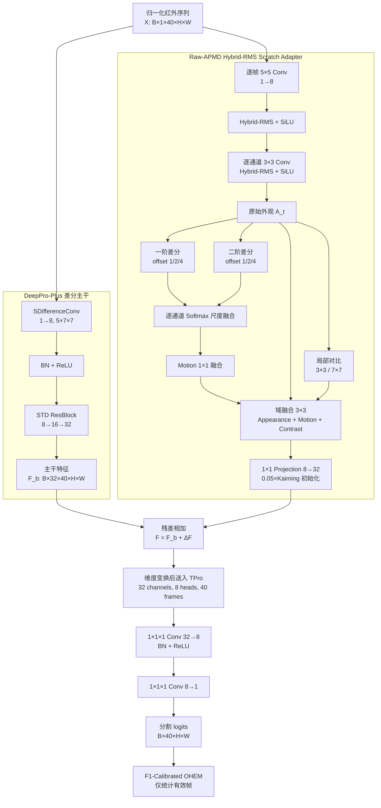
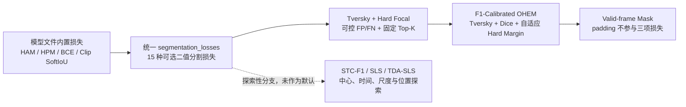

# DeepPro 模型历次更新、当前框架与损失函数说明

> **历史快照警告（2026-09-10）：** 本文冻结的是 2026-08-26 至 08-27 的 SatVideo
> 比赛研发状态。文中把 FeedbackSTS、F1-OHEM、100 epoch、AMP、Proxy F1 和提交 ZIP
> 写成“当前”的段落均已过时，不得作为现行命令执行。PointCenter、两套 NUDT 29 模型
> 论文指标、比赛最终 91.30、BC-TPro 和当前 Pd/Fa/AUC 协议请以
> [`EXPERIMENT_OPTIMIZATION_HANDOFF_2026-09-10.md`](EXPERIMENT_OPTIMIZATION_HANDOFF_2026-09-10.md)
> 为准。

> 文档日期：2026-08-26<br>
> 适用仓库：`DeepPro-main` / `migration-2026-08-24`<br>
> 当前研发约束：所有新训练必须从随机权重开始，禁止加载任何预训练初始化权重<br>
> 当前硬件约束：只使用物理 GPU 0、1、2；三张卡训练一个网络

## 1. 文档目的与结论摘要

本文统一说明从原始 DeepPro 到 scratch-only BRTD3，并记录 2026-08-27 转向
FeedbackSTS 优先候选前的结构演进，包括：

- 每一代模型增加、删除或移动了哪些模块；
- 各模块解决什么问题，以及实验暴露出的优缺点；
- 当前实际使用的网络框架和候选变体；
- 损失函数从早期 SoftIoU/HAM/HPM 到当前 `f1_calibrated_ohem` 的变化；
- 哪些结论已经有本地或网站分数支持，哪些仍只是待验证假设。

当前模型主线是：

```text
model             = DeepPro-FeedbackSTS
base structure    = 五级 3D U-Net + 双向稀疏语义反馈 + 金字塔形变对齐
historical base   = raw_apmd_hybrid_rms scratch (website 86.71)
completed variants= scratch-init 86.45; scratch-bandpass 86.47
active variant    = feedbacksts_l40_t2_recallaug_ddp3_seed47
initialization    = scratch-only
loss              = recall-oriented f1_calibrated_ohem
valid-frame mask  = enabled
```

需要特别区分两个结论：

1. 历史实验表明预训练版本分数更高，四组严格配对实验的网站平均优势为 `+1.7275`；
2. 从 2026-08-25 起，项目研发规则明确要求全部新实验 scratch-only，因此当前代码会拒绝
   `base_ckpt`、`spatial_ckpt` 和 `st_ckpt`。

当前结构并不是历史网站最高分结构的简单复用，而是在 scratch-only 约束下重新解决优化
问题：将适配器末端的全零投影改为 `0.05 × Kaiming` 小幅非零初始化，使适配器上游从
第一个反向步骤就能获得梯度。该机制已通过梯度检查，但 standalone 网站结果为
`86.45`，没有超过原 Hybrid-RMS 的 `86.71`；bandpass 最终也只有 `86.47`。当前转向
独立的 FeedbackSTS 风格网络，完整依据见 `F1_MAXIMIZATION_RESEARCH_2026-08-27.md`。

---

## 2. 模型演进总览

```mermaid
flowchart LR
    A["DeepPro<br/>三尺度 TD 主干<br/>3 个 TPro"]
    B["DeepPro-Plus<br/>单路全分辨率 SD/STD<br/>1 个 TPro"]
    C["TDCR / TDCSTA 探索<br/>TDC + 时空/空间双支路<br/>Self/Cross Attention"]
    D["BRTD1<br/>浅层背景参考<br/>时差分 + Gate"]
    E["BRTD2<br/>深层语义适配<br/>3/5/9 帧 + Appearance"]
    F["BRTD3<br/>统一可插拔残差适配器"]
    G["Raw-APMD<br/>原始外观 + 一/二阶运动<br/>局部对比，无 Gate"]
    H["RMS / Channel-RMS<br/>保留绝对亮度"]
    I["Hybrid-RMS<br/>共享/逐通道能量可学习收缩"]
    J["Scratch-init<br/>0.05×Kaiming 投影"]
    K["Bandpass / Detail<br/>当前后续单变量候选"]

    A -->|"删除多尺度池化与重复 TPro"| B
    B -.->|"并行探索，未成为主线"| C
    B -->|"加入浅层适配器"| D
    D -->|"移动到 32 通道深层并保留外观"| E
    E -->|"抽象为候选框架"| F
    F -->|"加入独立 raw-frame 旁路"| G
    G -->|"替换逐帧 GroupNorm"| H
    H -->|"解决 Channel-RMS 波动"| I
    I -->|"适配 scratch 优化"| J
    J -->|"补充中频或主干细节"| K
```



### 2.1 关键版本时间线

| 日期 | Git/阶段 | 主要变化 | 当前定位 |
|---|---|---|---|
| 2026-06-28 | `96b2ea0` | 初始化 DeepPro 与 DeepPro-Plus 工程 | 基础实现 |
| 2026-07-01 | `829e1b8` | 增加 TDCR，探索显式时间差分卷积 | 候选，不是当前主线 |
| 2026-07-01 | `54b0a04` | 增加 TDCSTA，自注意力和交叉注意力融合多支路 | 候选，不是当前主线 |
| 2026-07-02 | `b6c9a83` | TDCSTA 三阶段训练和支路预训练流程 | 已被 scratch-only 策略停用 |
| 2026-07-15/21 | `ddcb133` / `d2cc7b3` | BRTD1：背景参考、时间差分、门控残差 | 历史消融 |
| 2026-07-22 | `affc323` | 建立统一二值分割损失库 | 仍在使用 |
| 2026-08-07 | `9efed80` | 增加 `f1_calibrated_ohem` | 当前损失 |
| 2026-08-11 | `5052f64` | BRTD3 与八种结构候选框架 | 当前模型容器 |
| 2026-08-17 | `c1d8ba3` | Raw-APMD 原始外观/运动/对比分支 | 当前结构母体 |
| 2026-08-20~23 | 迁移工作树，后由 `268838b` 打包 | RMS、Channel-RMS、Hybrid-RMS、motion detrend、multiscale contrast | 历史主线与消融 |
| 2026-08-25 | `e5bdbdf` | scratch-only、三卡 DDP、非零投影、bandpass/detail 候选 | 当前研发主线 |
| 2026-08-27 | 待本轮提交 | FeedbackSTS 双向语义反馈、形变对齐、召回导向损失 | 当前优先候选 |
| 2026-08-26 | `f8fe6d6` | SwanLab 收尾失败不再阻断本地后处理和 ZIP | 工程可靠性修复 |

---

## 3. 各代模型的框架变化

### 3.1 原始 DeepPro

原始 `DeepPro` 使用三个空间尺度。输入先经普通时域卷积形成 8 通道特征，随后构造：

- 原分辨率分支；
- 一次 `2×2` 空间池化分支；
- 两次 `2×2` 空间池化分支。

每个分支包含 TD 残差块和独立 TPro，最后上采样到原分辨率后拼接融合。

优点：

- 多尺度上下文较强；
- 三个 TPro 可以分别学习不同空间尺度的时域轮廓。

缺点：

- 池化容易抹除宽高只有 2~5 像素的目标；
- 三个 TPro 带来重复计算和显存开销；
- 多尺度上采样可能模糊质心位置。

### 3.2 DeepPro-Plus：当前主干的来源

DeepPro-Plus 删除三尺度池化、多分支 TPro 和上采样融合，改为单路全分辨率处理：

```text
Input [B,1,T,H,W]
  -> SDifferenceConv 1->8, kernel 5x7x7
  -> BatchNorm3d + ReLU
  -> STD_Resblock 8->16
  -> STD_Resblock 16->32
  -> TPro, 32 channels, 8 heads
  -> Conv1x1x1 32->8 + BN + ReLU
  -> Conv1x1x1 8->1
  -> logits [B,T,H,W]
```

相对原始 DeepPro，主要删除项是多尺度池化、三个独立 TPro 和上采样拼接；主要保留项
是逐像素时间剖面建模。它的基础参数量约 `70,913`。

优点：

- 全程保持空间分辨率，更适合极小目标；
- 结构小，训练速度和参数效率好；
- SDifference/STD 对杂波抑制强，通常具有较高 Precision；
- TPro 直接建模 40 帧长时信息。

缺点：

- 差分主干会削弱绝对亮度弱、静止或慢速目标，Recall 容易成为瓶颈；
- TPro 在固定像素位置建模，不能显式消除相机运动；
- 全分辨率 TPro 的完整帧推理显存高，当前 24 GB GPU 必须使用 AMP 和按行分块。

### 3.3 TDCR / TDCSTA：多分支注意力探索

TDCSTA 前端包含：

- TDCR 显式时间差分支路，作为 Query；
- 普通 3D 时空卷积分支，作为 Key；
- 当前帧 2D 空间分支，作为 Value；
- 三个窗口 Self-Attention 和一个 Cross-Attention。

这条路线的优点是运动、时空外观和空间细节分工明确；缺点是结构复杂、依赖多阶段训练，
而且原流程会加载 2D/3D 支路预训练权重。当前 scratch-only 策略下，训练入口和模型都
会拒绝这些支路 checkpoint，因此 TDCSTA 不属于当前主线。

### 3.4 BRTD1：浅层背景参考时差分适配器

BRTD1 在 8 通道 SDifference stem 后、STD 残差块前加入适配器，包括环形背景参考、
自适应时间差分和 Sigmoid 可靠性门控。

新增模块的目的：

- 用局部背景参考识别与周围不一致的弱目标；
- 用显式时域高通增强运动；
- 用门控减少不可靠残差。

实验结果显示，BRTD1 单模型弱于 DeepPro-Plus，但与 DeepPro 概率融合后提高，说明它
提供了互补信息。主要问题是适配器位置太浅，强差分和门控会把弱目标与背景一起抑制，
导致 Recall 下降。

### 3.5 BRTD2：移动到深层并保留外观

BRTD2 将适配器从 8 通道浅层移动到两个 STD 残差块之后的 32 通道语义层，并增加：

- 显式 appearance 路径；
- dilation 为 1/2/4 的时域卷积，对应 3/5/9 帧感受野；
- 逐时刻自适应尺度路由；
- 3×3/7×7 局部对比；
- GroupNorm；
- 零初始化 residual projection。

相比 BRTD1，它不再强迫所有目标证据经过高通分支。后续消融发现 no-gate 优于带
Sigmoid gate 的版本，因此“输入依赖门控可能压掉弱目标”成为后续 Raw-APMD 的重要
设计约束。

### 3.6 BRTD3：统一结构适配器框架

BRTD3 保持 DeepPro-Plus 主干不变，通过 `structure_variant` 在不同位置插入统一的
`brtd.*` 残差适配器：

| 插入位置 | 变体 |
|---|---|
| 8 通道 stem 后 | `lfp_shallow` |
| 32 通道 STD 主干后、TPro 前 | `second_order`、`lfp_deep`、`global_align`、`local_align`、`bidirectional`、`tdc_dual_stream` |
| 原始帧与 32 通道特征融合 | 所有 `raw_apmd*` |
| TPro 后、输出头前 | `multiscale_head` |

这一代的价值不是某个单独模块，而是建立了统一的单变量结构实验平台。历史适配器使用
全零末端投影，便于加载基础权重时保持预测完全一致；但在 scratch 训练中也带来第一步
上游分支梯度为零的问题。

---

## 4. 当前模型框架

### 4.1 总体框架图

当前 `raw_apmd_hybrid_rms_scratch_init` 的数据流如下：



### 4.2 Raw-APMD 的四类证据

1. 原始外观 `A_t`：绕过差分 stem，保存弱目标的绝对辐射信息。
2. 一阶运动：

   ```text
   D1_s(t) = 0.5 × (A_{t+s} - A_{t-s}), s ∈ {1,2,4}
   ```

3. 二阶运动：

   ```text
   D2_s(t) = A_{t+s} - 2A_t + A_{t-s}
   ```

4. 局部对比：当前基础 Hybrid-RMS 使用 3×3 和 7×7 周围均值构造中心—周边响应。

每个 bottleneck 通道独立学习一阶、二阶的时间尺度权重。序列 loader 产生的零 padding
由有效帧 mask 识别：无效邻帧用当前有效帧替代，因此不会把 padding 边界误认为运动；
无效帧的外观、运动、对比度和 residual 都被置零。

### 4.3 Hybrid-RMS

逐帧 GroupNorm 会减去均值，削弱 Raw-APMD 想保存的绝对亮度。共享 RMS 不减均值但
可能让强通道统一缩放弱通道；Channel-RMS 避免跨通道干扰，却在两个 seed 上出现明显
校准和网站分数波动。Hybrid-RMS 对两类二阶矩做逐通道可学习收缩：

```text
m_shared(t)    = mean over channel and space of x²
m_channel(c,t) = mean over space of x_c²
lambda_c       = sigmoid(channel_mix_logit_c), initial value = 0.5
m_blend        = (1-lambda_c) × m_shared + lambda_c × m_channel
y_c            = x_c / sqrt(m_blend + eps) × gamma_c
```

优点是兼顾共享统计的稳定性与逐通道统计的灵活性；代价是归一化方式会影响 logit 校准，
仍需通过多 seed 和阈值扫描验证泛化。

### 4.4 Scratch 非零投影

历史 BRTD3/Raw-APMD 的末端 projection 全零，适合预训练残差插入，因为初始预测与基础
模型完全相同。但从随机权重训练时，第一步梯度只能到达 projection，projection 之前的
外观、运动和对比分支上游梯度严格为零。

当前 `scratch_init` 将 projection 改为：

```text
W_projection = 0.05 × KaimingNormal()
```

优点：整个 adapter 从第一步即可学习，同时残差幅度仍较小。缺点：不再具备“初始输出
严格等于无适配器主干”的性质，随机残差可能增加早期波动，因此必须与同 seed 的全零
Hybrid-RMS scratch 基线比较。

### 4.5 当前三个 scratch 候选

| 变体 | 相对母体的唯一变化 | Adapter 参数 | 预期优点 | 主要风险 | 状态 |
|---|---|---:|---|---|---|
| `raw_apmd_hybrid_rms_scratch_init` | projection 改为 `0.05×Kaiming` | 2,496 | 解除首步梯度阻断 | 初始随机残差扰动 | 已完成；网站 86.45，未超过基线 |
| `raw_apmd_hybrid_rms_scratch_bandpass` | 再加入有效帧 3/9 帧均值之差 | 3,072 | 强化中等速度和中频弱目标 | 可能削弱极慢目标或放大闪烁 | 已完成；网站 86.47，未超过基线 |
| `raw_apmd_hybrid_rms_scratch_detail` | 再加入主干 32→8 的 1×1 细节直连 | 3,344 | 补充差分主干细节，避免 raw 分支独占融合 | 可能重复引入杂波 | 已实现，尚未正式三卡训练 |

Bandpass 定义为：

```text
B_t = MaskedAvgPoolTemporal_3(A)_t - MaskedAvgPoolTemporal_9(A)_t
```

时间均值按有效帧数量归一化，padding 不参与统计。

### 4.6 已从 scratch 默认结构删除但仍保留在代码中的模块

| 模块 | 设计作用 | Scratch 网站效果（相对 Hybrid-RMS 86.71） | 当前决定 |
|---|---|---:|---|
| Motion detrend | 用 15×15 均值去除相干低频运动 | `86.33`，`-0.38` | 不作为默认模块 |
| Multiscale contrast | 每通道学习 3/5/7 对比尺度 | `86.05`，`-0.66` | 不作为默认模块 |
| Motion + Multiscale | 同时去趋势和多尺度对比 | `86.34`，`-0.37` | 不作为 scratch 默认模块 |
| Sigmoid reliability gate | 输入依赖地抑制不可靠残差 | BRTD2 no-gate 更好 | Raw-APMD 中删除 |
| 预训练零投影逻辑 | 保持插入 adapter 前后初始输出一致 | 适合 pretrained，不利于 scratch 首步上游梯度 | scratch 候选改为小幅非零 |

这些模块没有从源代码物理删除，因为仍需复现实验和审计；“从当前默认结构删除”表示
新 scratch 主线不会自动启用它们。

---

## 5. 当前模型的整体优缺点

### 5.1 优点

- 全分辨率：没有空间下采样，适配验证集中位面积 6 像素的目标。
- 长时建模：TPro 使用 40 帧逐像素时间剖面，保留 DeepPro 最成熟的主干能力。
- 高 Precision 基础：SDifference/STD 能有效抑制大面积背景。
- 补充 Recall：Raw-APMD 为绝对外观提供独立路径，不再要求弱目标全部经过差分高通。
- 多时间尺度：一阶和二阶运动在 offset 1/2/4 上按通道自适应融合。
- 无破坏性门控：适配器残差直接相加，避免 Sigmoid gate 把低响应目标关掉。
- 小参数量：当前 scratch-init 总参数约 `73,409`，仅比 DeepPro-Plus 多 `2,496`。
- Padding 安全：网络 adapter 和当前 loss 都显式屏蔽无效补帧。
- 易消融：BRTD3 统一接口使新增模块可以保持其他训练变量不变。

### 5.2 缺点与风险

- Recall 仍是主要瓶颈；历史 Hybrid-RMS scratch 的 Precision/Recall 为
  `0.948090 / 0.654517`。
- 当前损失中 FP 权重 `0.6` 高于 FN 权重 `0.4`，更偏向低虚警，可能限制 Recall。
- 固定像素的一、二阶差分仍混合目标运动与相机/背景运动。
- Raw appearance 会同时带回目标和背景纹理；删除 gate 后缺少逐样本可靠性抑制机制。
- Hybrid-RMS 的通道收缩权重和后处理阈值可能随 seed 漂移，必须做多 seed 复验。
- 非零 projection 改善优化但失去严格 identity initialization，需要用实验而不是理论
  假定其一定提高最终分数。
- 像素 F1、质心 Proxy F1、网站 Score 和轨迹得分并不等价。
- TPro 完整推理显存接近 24 GB；当前日志中 AMP + `eval_chunk_rows=32` 峰值约
  `22.665 GiB`，继续增加宽度或高分辨率分支风险较高。Raw-APMD 多域结构还必须使用
  分域卷积求和的低显存验证路径，避免创建全尺寸 domain concat 临时张量。
- Scratch-only 是研发约束而非性能最优证据；历史配对数据明确显示预训练更强。

---

## 6. 损失函数演进

### 6.1 演进图



### 6.2 早期损失

早期每个模型文件内部直接定义损失包装：

- `BCEWithLogitsLoss`：逐像素二分类，简单稳定，但易被海量背景像素主导；
- clip SoftIoU：整段 `[T,H,W]` 计算软交并比，直接优化重叠，但不单独控制 FP/FN；
- HAM：保留全部目标及目标保护区，并从时间聚合的高损失背景和随机背景中抽样，抽样点
  周围也扩张监督区域；
- HPM：与 HAM 类似地挖掘困难/随机背景，但不对抽样背景再次做邻域扩张。

HAM/HPM 的固定随机抽样和求和归约对 batch、分辨率与序列长度较敏感，因此后续训练
入口改为统一损失库。

### 6.3 统一损失库

`networks/losses/segmentation_losses.py` 当前支持：

```text
soft_iou, frame_soft_iou, bce, focal, dice, bce_dice,
tversky, focal_tversky, lovasz, sls_iou, tda_sls,
hard_focal, tversky_hard_focal, stc_f1, f1_calibrated_ohem
```

主要变化是统一输入为 `[B,T,H,W]` logits/target，并加入形状、dtype 和参数校验。
SLS/TDA-SLS/STC-F1 分别探索尺度位置、目标难度、中心响应和时间一致性，但 TDA-SLS
需要 CPU 连通域，速度较慢；这些探索没有形成比 F1-OHEM 更稳定的主线证据。

### 6.4 Tversky + Hard Focal 阶段

Tversky 允许分别控制 FP 和 FN；Hard Focal 使用所有正样本与固定 Top-K 困难背景，
避免容易负样本淹没目标。BRTD2 阶段曾使用 `tversky_hard_focal`，但固定 Top-K 不随
每段视频实际目标数量变化，而且损失与结构同时变动时难以归因，后来改用自适应 OHEM。

---

## 7. 当前损失：F1-Calibrated OHEM

### 7.1 总公式

当前所有正式结构对照固定使用：

```text
L_total = L_tversky + 0.15 × L_dice + lambda_h(epoch) × L_hard_margin
```

逐帧 Tversky：

```text
L_tversky = 1 - (TP + eps) / (TP + 0.6×FP + 0.4×FN + eps)
```

逐帧 Dice：

```text
L_dice = 1 - (2×TP + eps) / (sum(probability) + sum(target) + eps)
```

Hard-margin OHEM：

```text
positive_loss = mean softplus(1 - positive_logit)
negative_loss = mean TopK[softplus(1 + negative_logit)]

K = min(number_of_negatives,
        4096,
        max(256, ceil(4 × number_of_positives)))

L_hard_margin = 0.4 × positive_loss + 0.6 × negative_loss
```

OHEM 权重调度：

- 前 5 epoch：`lambda_h = 0`；
- 随后 10 epoch：线性增加；
- 最终：`lambda_h = 0.10`。

### 7.2 当前参数

| 参数 | 当前值 | 含义 |
|---|---:|---|
| `tversky_fp_weight` | 0.6 | 提高虚警代价 |
| `tversky_fn_weight` | 0.4 | 漏检代价 |
| `dice_weight` | 0.15 | 对称重叠补充项 |
| `hard_weight` | 0.10 | OHEM 最终权重 |
| `negative_ratio` | 4.0 | 困难负样本数相对正样本数 |
| `min_negatives` | 256 | 每 clip 最少困难背景数 |
| `max_negatives` | 4096 | 每 clip 最多困难背景数 |
| `margin` | 1.0 | 正负 logit 间隔 |
| `warmup_epochs` | 5 | OHEM 暂停期 |
| `ramp_epochs` | 10 | OHEM 权重爬升期 |
| `mask_padded_frames` | 1 | padding 不参与损失 |

### 7.3 优点

- Tversky 直接表达 FP/FN 权衡，适合极端类别不平衡；
- Dice 防止只关注少量困难像素而丢失整体目标区域；
- OHEM 只选择高损失背景，不被海量容易背景稀释；
- 困难负样本数量随正样本数量变化，比固定 Top-K 更适配不同 clip；
- warmup 避免随机初始化初期过早强化不稳定 hard negatives；
- 有效帧 mask 同时作用于 Tversky、Dice 和 OHEM；
- 所有候选固定同一损失，结构差异更容易归因。

### 7.4 缺点

- 它仍是像素级代理目标，不直接优化质心距离、轨迹连续性或网站最终 Score；
- 当前 `FP=0.6, FN=0.4` 更偏 Precision，而历史主要瓶颈是 Recall；
- Top-K 负样本和 margin 会受 logit 校准影响，不同 seed 的最佳阈值仍可能漂移；
- 无目标 clip 至少选 256 个困难负样本，可能继续强化背景抑制；
- 通过阈值扫描得到的最佳质心 F1 不能由训练 loss 单独保证；
- 加中心热图或直接质心监督可能更贴近比赛目标，但会改变实验归因，需单独设计对照。

### 7.5 为什么目前不同时修改损失

新一轮主要验证非零 projection、bandpass 和 detail 三个结构变量。如果结构和 loss 同时
修改，即使分数变化也无法判断来源。因此当前三种候选继续固定 F1-OHEM。只有结构主线
确定后，才适合单独比较：

1. 降低 FP 权重或提高 FN 权重以改善 Recall；
2. 困难正样本加权；
3. 中心热图/质心一致性辅助损失；
4. 与轨迹连续性相关的轻量时序监督。

---

## 8. 实验结果如何影响模块取舍

### 8.1 早期模型

| 方案 | 网站结果 | 本地 Proxy F1 | 结论 |
|---|---:|---:|---|
| DeepPro-Plus + F1-OHEM，约 epoch 45 | 84.91 | 0.75960 | 强单模型基线 |
| DeepPro-Plus + F1-OHEM，100 epoch | 84.13 | — | 训练更久不一定更好 |
| BRTD1，50 epoch | 82.35 | 约 0.73819 | 门控/高通过强，Recall 低 |
| BRTD1，100 epoch | 83.23 | 约 0.73819 | 延长训练仍未追平 |
| BRTD2，约 epoch 45 | 80.89 | — | 深层适配仍未直接成功 |
| DeepPro epoch45 + BRTD 融合 | 85.59 | 0.76296 | BRTD 有互补性但单模型弱 |

### 8.2 Raw-APMD

| Seed | DeepPro Proxy F1 | Raw-APMD Proxy F1 | 提升 |
|---:|---:|---:|---:|
| 47 | 0.760839 | 0.785431 | +0.024592 |
| 49 | 0.770413 | 0.777190 | +0.006777 |

Raw-APMD 的提升主要来自 Recall，同时 Precision 仍约为 0.93，因此“增加独立原始外观
路径、取消 gate”是当前最有直接证据的结构变化。

### 8.3 归一化和结构扩展

| 变体 | 网站 seed47 | 网站 seed49 | 均值 | 观察 |
|---|---:|---:|---:|---|
| RMS | 87.41 | 87.01 | 87.21 | 较稳定 |
| Channel-RMS | 88.33 | 86.19 | 87.26 | 单次高，但跨 seed 波动最大 |
| Motion detrend | 87.18 | 88.09 | 87.64 | 早期均值最好 |
| Multiscale contrast | 87.31 | 87.32 | 87.32 | 最稳定，但上限有限 |

这些结果促成 Hybrid-RMS：不在共享 RMS 和 Channel-RMS 之间硬选，而是学习收缩比例。

### 8.4 最后八个严格配对网站结果

| 结构 | Scratch | Pretrained | Pretrained - Scratch |
|---|---:|---:|---:|
| Hybrid-RMS | **86.71** | 88.07 | +1.36 |
| Hybrid-RMS + Motion | 86.33 | 87.97 | +1.64 |
| Hybrid-RMS + Multiscale | 86.05 | 87.52 | +1.47 |
| Hybrid-RMS + Motion + Multiscale | 86.34 | **88.78** | +2.44 |

在 scratch 条件下，纯 Hybrid-RMS 最好，因此 motion detrend 和 multiscale contrast
从 scratch 默认主线移除。预训练组中两者共同启用存在正交互，但该结论不能直接迁移到
当前 scratch-only 策略。

### 8.5 Scratch-init 的最终结果

`raw_apmd_hybrid_rms_scratch_init` 已完成 100 epoch：

- pixel F1 最优为 `0.520041`，epoch 80；
- epoch 80 质心扫描结果为 Precision `0.954120`、Recall `0.646924`、
  Proxy F1 `0.771051`，阈值 `0.16`、`min_area=2`；
- Top-5 checkpoint 为 epoch `80 / 95 / 85 / 60 / 70`，完整扫描最终仍选择 epoch 80；
- 已生成并校验 `submit_hrms_scratch_init_ddp3_seed47_best_proxy_f1.zip`；
- 网站提交 ID `902114` 得分 `86.45`，比历史 Hybrid-RMS scratch `86.71` 低 `0.26`；
- 本地 Proxy F1 同样比历史 `0.774414` 低 `0.003363`，本地与网站方向一致。

结论是：小幅非零 projection 解决了首步上游梯度阻断，但没有单独带来更好的最终性能，
因此不能替换原 Hybrid-RMS 成绩基线。bandpass 最终网站 `86.47`，虽比 scratch-init
高 `0.02`，仍低于 `86.71`，所以也不能证明整个组合值得采用。

---

## 9. 当前训练与评估配置

| 配置 | 当前值 |
|---|---|
| Model | `DeepPro-Plus_BRTD3` |
| Initialization | scratch，代码强制禁止预训练 |
| Sequence / patch | 40 帧 / 128×128 |
| Optimizer | Adam |
| Adapter LR | 0.001 |
| Backbone LR | 0.005（`base_lr_mult=5.0`） |
| Weight decay | 0.0001 |
| Epoch | 100 |
| LR step / decay | 10 / 0.7 |
| Global batch | 18，GPU 0/1/2 各 6 |
| Gradient accumulation | 1 |
| Loss | `f1_calibrated_ohem` |
| Eval interval | 每 5 epoch，最终 epoch 必评 |
| Early stopping | eval F1，patience 30，epoch 15 后启用 |
| Validation | 三个 DDP rank 分片 |
| Inference | AMP，`eval_chunk_rows=32` |
| Checkpoint selection | pixel F1 Top-5 后逐一做质心扫描 |
| Centroid sweep | threshold 0.10~0.95，步长 0.01；min area 1/2/3 |
| Visualization | SwanLab cloud；云端收尾失败不阻断本地产物 |
| Submission | 质心 -> 轨迹 TXT -> ZIP -> 完整性校验 -> SHA256 |

---

## 10. 代码位置与复现入口

| 内容 | 文件 |
|---|---|
| 当前 BRTD3 容器 | `networks/models/DeepPro-Plus_BRTD3.py` |
| Raw-APMD、Hybrid-RMS 和全部候选 | `networks/layers/structure_adapters.py` |
| 当前损失及其他可选损失 | `networks/losses/segmentation_losses.py` |
| 模型、loss、scratch 策略与 DDP 训练 | `train.py` |
| AMP/分块推理与概率导出 | `test.py` |
| 三卡结构实验与自动 ZIP | `tools/run_structure_candidate_experiment.sh` |
| 当前优先实验启动器 | `tools/launch_priority_scratch_ddp3.sh` |
| 后处理断点恢复 | `tools/resume_structure_candidate_postprocess.sh` |
| 前一实验完成后启动 bandpass | `tools/finish_init_then_launch_bandpass_ddp3.sh` |
| 网站八次结果分析 | `WEBSITE_RESULTS_ANALYSIS_2026-08-25.md` |
| Scratch 三候选设计与验收 | `SCRATCH_MODEL_IMPROVEMENT_2026-08-25.md` |
| 迁移前完整技术记录 | `MIGRATION_HANDOFF_2026-08-24.md` |

测试历史 checkpoint 时应优先使用实验目录中保存的模型和 adapter 源码快照，不能假设
仓库根目录的最新源码与所有旧 checkpoint 完全兼容。

---

## 11. 推荐的后续决策顺序

1. Scratch-init、bandpass 均已完成，网站 `86.45 / 86.47`，都不升级为新基线。
2. 首先运行 FeedbackSTS T=2 双向反馈网络和 recall-oriented loss；不继续训练 detail。
3. 本地 Proxy F1 超过 `0.774414` 后才提交网站，网站超过 `86.71` 后才升级基线。
4. 若首轮失败，固定 FeedbackSTS 分别恢复旧损失、增加中心高斯辅助头，定位结构与损失
   的贡献，而不回到已负收益的 motion detrend/multiscale contrast。
5. 单 seed 胜出后补 seed 49；所有实验继续遵守 scratch-only、GPU 0/1/2、SwanLab
   和自动 ZIP 验证规则。

---

## 12. 结论

模型演进的核心不是不断叠加模块，而是逐步纠正三个主要矛盾：

1. 从原始多尺度池化收敛到全分辨率 DeepPro-Plus，避免极小目标被下采样抹除；
2. 从 BRTD1/BRTD2 的强差分和门控，转向 Raw-APMD 的原始外观无门控残差，改善 Recall；
3. 从 GroupNorm、共享 RMS、Channel-RMS 的二选一，转向 Hybrid-RMS 的可学习能量收缩，
   在绝对亮度保存和跨 seed 稳定性之间折中。

当前 scratch-only 阶段进一步发现：小幅非零 residual projection 能解除首步梯度阻断，
但 scratch-init/bandpass 的 `86.45 / 86.47` 都低于 `86.71`，说明优化机制修复和微小
结构增量不能直接等同于泛化提升。当前已转向多尺度、显式对齐、双向反馈的完整网络，
并依据 FN 主导的误差结构调整 F1-Calibrated OHEM。最终仍以本地质心代理和网站结果
共同验证，不把结构动机写成已实现的性能提升。
