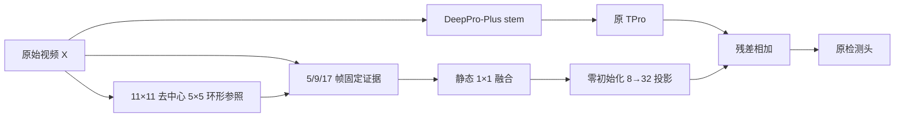

# BC-TPro 第一阶段预注册实验

## 研究问题

在保留 DeepPro-Plus 全局 TPro 的前提下，原始视频中的局部多尺度时间证据，尤其是中心像素相对于环形背景的时间响应，能否在相同检测率下减少虚警？

本阶段只验证最小机制链，不加入动态门控、低秩动态 TPro、轨迹验证、额外损失或预训练权重。这样可以分别回答“增加分支容量”“局部零直流时间响应”“背景参照”三个问题。



B1 关闭整条证据旁路；C0/C1 不使用环形参照；C2 才启用图中的 Ring 路径。证据始终从原始视频生成，避免深层感受野中的目标泄漏到“背景参照”。

## Material Passport

- 训练数据：`NUDT-MIRSDT` 的官方 `train.txt` 所含 80 个序列。
- 固定划分：seed `20260908`，64 个序列训练、16 个序列验证；划分只依据序列名，不读取图像或标签。
- 隔离规则：官方 `test.txt` 不参与训练、选模、阈值选择和第一阶段结论。
- 鲁棒性数据：对同一 Clean 训练权重，在 `NUDT-MIRSDT-Noise8.0_FJY` 的相同 16 个验证序列上测试；不在 Noise8 上重新训练。
- 输入：40 帧，128×128 随机裁块，sample rate 0.1。
- 优化：Adam，Soft-IoU，32 epoch，初始学习率 0.001，每 10 epoch 乘 0.7，global batch 4。
- 随机种子：47、49、51；每个 seed 固定映射至物理 GPU 0、1、2。
- 精度：训练和独立评测均使用 AMP。训练使用确定性 cuDNN；独立全幅评测
  为规避下述已确认的 Xid 31 算法路径，使用 fresh、串行进程和默认
  非确定性 cuDNN。候选验证结果揭盲前登记的 logit 排序敏感性方案及 C3
  授权规则见 `PROTOCOL_AMENDMENT_2026-09-09.md`。
- 评测隔离：本机 RTX 3090/PyTorch 2.1.2/CUDA 12.1 在确定性 cuDNN
  下，对验证首帧尺寸 `1×32×40×271×396` 执行 DeepPro 原始第二个
  `STD_Resblock` 的膨胀 `SDifferenceConv` 时可复现触发 NVIDIA Xid 31；
  同算子关闭确定性路径后正常。为保留确定性训练，训练固定运行 32 epoch，
  进程内整幅验证关闭；训练完成后由全新、串行的 `test.py` 进程在
  Clean/Noise8 上评测固定 `epoch_32_model.pth`。该隔离只规避 CUDA 算法
  路径故障，不改变训练更新、模型结构或模型选择规则。
- 模型选择：不使用验证集选出的 `best_model.pth`；所有主结果统一评价 `epoch_32_model.pth`。
- 初始化：全模型随机初始化。`base_ckpt`、`spatial_ckpt`、`st_ckpt` 必须为空。
- 可视化：SwanLab project `DeepPro-BC-TPro`，group `bc-tpro-stage1-scratch`。

## 结构消融

| 代号 | variant | 修改 | 目的 |
|---|---|---|---|
| B1 | `none` | 原 DeepPro-Plus | 直接结构基线 |
| C0 | `temporal_control` | 5/9/17 帧普通 masked temporal average + 静态残差映射 | 排除仅由新增容量带来的收益 |
| C1 | `center_multiscale` | 中心像素 5/9/17 帧固定、归一化、零直流响应 | 检验局部时间尺度定位 |
| C2 | `center_ring` | C1 加 11×11 排除中心 5×5 的环形背景响应，静态融合 | 检验显式背景参照的增量价值 |

C0 与 C1 使用相同 `3→8→32` 参数化；C2 仅因 9 通道证据比 C0/C1 多少量静态融合参数。所有新增残差投影零初始化，因此每个 seed 在第一个优化步之前与 B1 的 logits 完全一致。主干、TPro 和检测头在同 seed 下也必须逐张量同初值。

## 指标和分析顺序

主要指标与 DeepPro-Plus 论文协议对齐：

1. `Pd @ fixed Fa`：Fa 预算取同 seed、同验证条件的 B1 在阈值 0.5 处的 Fa。
2. `Fa @ fixed Pd`：Pd 目标取同 seed、同验证条件的 B1 在阈值 0.5 处的 Pd。
3. 低虚警区归一化 pAUC：`Fa <= 5e-5`。
4. 完整 Pd-Fa AUC，以及阈值 0.5 的 Pd/Fa，作为论文协议补充。
5. Pixel IoU/F1 仅作诊断，不作为结构创新的主要判断依据。
6. 参数量、端到端推理时间和 CUDA 峰值显存。

报告每个 seed 的原始结果、相对同 seed B1 的配对差值，以及 3 seeds 的均值和样本标准差。只有三个 seeds，因此不把 `p>0.05` 解释为无效，也不把单次最好结果解释为稳定提升。

## 预设继续门槛

只有 C2 同时满足以下条件，才进入 C3（输入动态门控）：

- Clean 验证集上，`Fa @ fixed Pd` 相对 B1 平均下降至少 20%；
- Clean 验证集上，`Pd @ fixed Fa` 平均下降不超过 1 个百分点；
- Noise8 验证方向不反转，且没有单 seed 的严重反向异常；
- 推理时间不超过同 seed B1 的 1.3 倍；
- 三个 seed 均完成且结构、数据隔离和 scratch-only 检查全部通过。

若 C2 未通过，则停止增加 C3/C4 的复杂度，并根据 C0/C1/C2 的机制结果修改假设。C5 轨迹验证属于第二条创新线，不在本阶段自动启动。

## 复现命令

预检查和打印命令：

```bash
DRY_RUN=1 bash tools/run_bc_tpro_stage1.sh
```

正式运行：

```bash
bash tools/run_bc_tpro_stage1.sh
```

完成后重新汇总：

```bash
/home/user/anaconda3/envs/sjyPID/bin/python tools/analyze_bc_tpro_stage1.py
```
